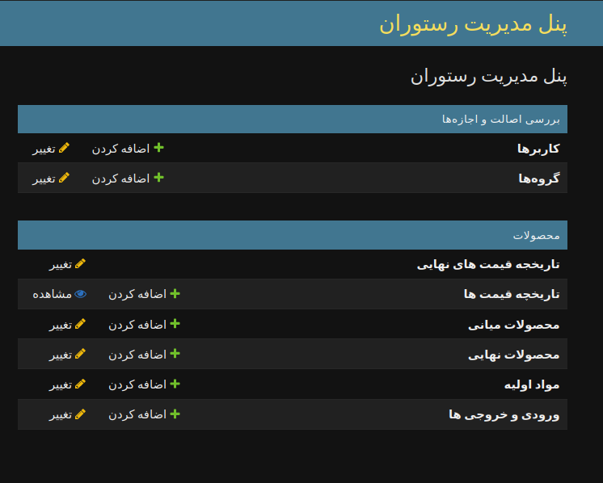

# پنل مدیریت رستوران 🌟

## دراین پروژه جنگو می توانید محصولات اولیه، محصولات نهایی،‌ فرمول ساخت محصولات نهایی را وارد کنید،‌تا قیمت برآورد محصول،‌به صورت خودکار محاسبه شده و با توجه به قیمت ثبت شده داخل منو میزان سود یا زیان به شما برگردد



## راه اندازی پروژه

### Set Up virtualenv

```bash
    virtualenv venv
```

### Activate virtualenv

```bash
    source venv/bin/activate
```

### Install requirements

```bash
    pip insatll -r requirements.txt
```

### .env file

```text
    SECRET_KEY=your_secret_key
    ALLOWED_HOSTS=your_host_url,localhost
```

### Run Migrations

```bash
    python manage.py makemigrations
```

```bash
    python manage.py migrate
```

### Create Super User

```bash
    python manage.py createsuperuser
```

### Run Server

```bash
    python manage.py runserver
```

## برخی امکانات پروژه

### -امکان وارد کردن تمامی قیمت ها و محصولات با فایل اکسل 📥

### -امکان محاسبه قیمت نهایی محصولات

### -امکان محاسبه سود یا زیان

### -امکان خروجی گرفتن از تمام محصولات و فرمول به دست آوردن آنها و قیمت های نهایی 📤
